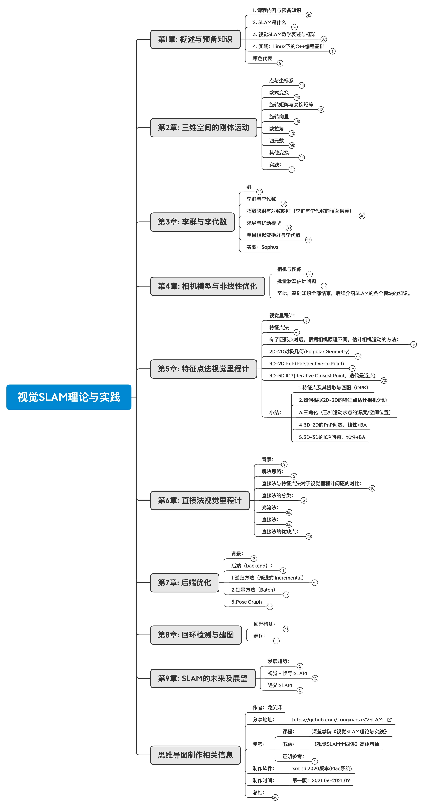

# 视觉slam（VSLAM）

项目介绍：视觉slam（VSLAM）：自己在学习视觉slam过程中的一些总结笔记。目前主要是学习高翔老师的《视觉slam十四讲》和《[深蓝学院视觉slam理论与实践](https://www.shenlanxueyuan.com/course/387)》课程笔记。后续会将一些slam其他开源项目总结到这里。如果本项目资料对您有帮助，欢迎点个star支持下！

## 一、视觉slam理论与实践课程

**这一部分主要是学习高翔老师的《视觉slam十四讲》和《[深蓝学院视觉slam理论与实践](https://www.shenlanxueyuan.com/course/387)》课程笔记。**

强烈推荐课程+视觉slam十四讲+本项目思维导图搭配学习

每一部分分为笔记和代码两部分，后续会慢慢更新。**（注：课后作业将不会再此项目进行更新。）**

笔记以思维导图的png和PDF格式导出，总结如下图所示：（如思维导图有错误，请在issue部分提出，我会在第一时间进行验证修改）

时间：2021年09月07日--更新笔记中思维导图
